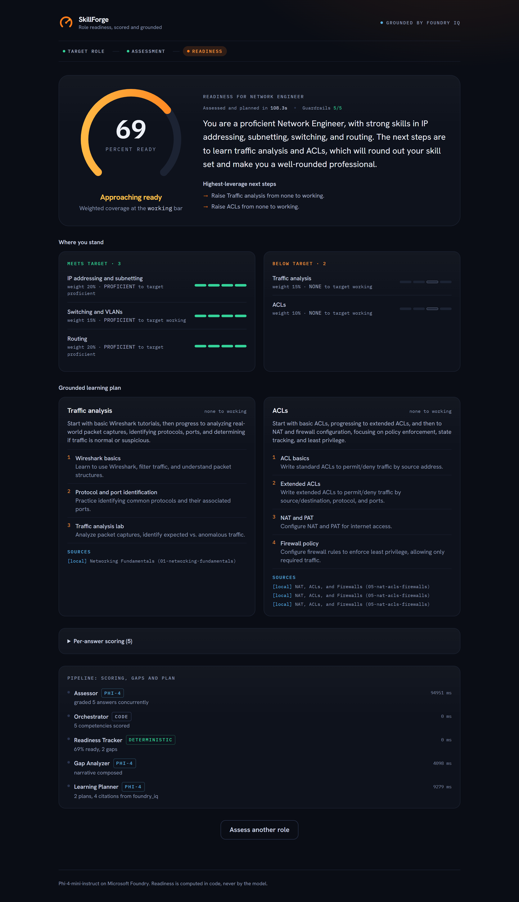

# SkillForge

**Know exactly how ready you are for a role, and get a grounded plan to close the gap.**

[](LICENSE)
[](https://www.python.org/)
[](tests/)
[](https://ai.azure.com/)

## What it does

Onboarding and internal mobility run on guesswork. A new hire or a person moving
into a different role is handed a generic checklist, and nobody can say in
concrete terms how close they actually are or what to study next. It is slow,
subjective, and the same for everyone.

SkillForge turns that into a measured result. You pick a target role, take a
short mock assessment, and the system scores your answers against that role's
competency profile, computes a weighted readiness percentage, separates your
strengths from your gaps, and builds a learning plan with citations to close
each gap.

The AI does the part that genuinely needs language: it writes role-specific
questions, grades free-text answers on a four-point scale, and drafts the
learning plan from grounded source material. Everything that has to be
trustworthy, the scoring and the readiness math, stays in deterministic code,
so the number on the gauge is reproducible and never invented by the model.

## How it works

Five agents run in a pipeline that the orchestrator drives and logs step by
step, so the multi-agent work is visible in the UI rather than hidden.

| Agent | What it does | Driven by |
| --- | --- | --- |
| Role Profiler | Loads the target role's competency profile and picks the competencies to probe | Deterministic |
| Assessor | Writes one question per top competency, then grades each free-text answer to none / aware / working / proficient | Model (Phi-4-mini) |
| Gap Analyzer | The gaps are computed in code; the model only turns them into a short narrative | Hybrid |
| Learning Planner | Retrieves grounded passages and writes a cited plan for each gap | Model + grounding |
| Readiness Tracker | Computes the weighted readiness percentage, strengths, gaps, and next steps | Deterministic |

The model only ever produces language. Every call runs in JSON mode at
temperature 0 against a tight schema with few-shot examples, carries a per-call
timeout with one retry, and the output is validated before it is trusted. The
per-answer evaluations and the per-gap plans are independent calls, so each set
runs concurrently and the step tracks the slowest single call rather than the
sum. If a call fails or the model is not configured, the agent falls back to
deterministic text and the whole pipeline still completes offline.

## Hybrid design: deterministic core, Foundry reasoning, Foundry IQ grounding

The system is split on purpose so that judgment and reasoning live in different
places.

- **Deterministic core (authoritative).** The role profiles, the four-point
  level scale, score aggregation, gap computation, and the readiness math all
  live in `skillforge/domain.py` and are driven entirely by `data/roles.json`.
  This is the source of truth. The model cannot change a score.
- **Microsoft Foundry reasoning.** `Phi-4-mini-instruct`, reached through the
  Foundry OpenAI-compatible endpoint with the `openai` SDK, handles the language:
  questions, answer grading, the gap narrative, and the plan prose.
- **Foundry IQ grounding.** The learning planner retrieves passages from a
  Foundry IQ knowledge base and writes plans that draw only on those passages.
  Every citation comes from the retrieval layer, not the model, so each plan is
  traceable to a real source. When Foundry IQ is not configured, retrieval falls
  back to a local seed corpus and the app stays fully usable offline.

## Readiness scoring

Each role carries a weighted set of competencies whose weights sum to 1.0, and
each competency has a target level on the **none / aware / working / proficient**
scale (values 0 to 3).

The assessor grades every answer to one of those four levels. Per competency,
coverage is the attained value over the target value, capped at 1.0. Readiness
is the weighted average of coverage across the competencies that were assessed,
with their weights renormalised to sum to one, so the gauge reflects the answers
actually given rather than penalising competencies that were never probed:

```
readiness = sum(weight * coverage) / sum(weight)   over assessed competencies
```

Grading is strict about substance, not keywords. A non-answer ("not sure",
blank, off-topic, or clearly wrong) scores **none**, and a missing or
unrecognised level is treated as a non-answer and also scores none. It is never
defaulted up to the target or to a working level, so an unanswered competency
cannot inflate the result. An on-topic, correct answer scores at least aware, so
a strong answer is not under-graded either.

## Guardrails

The pipeline's safety checks are collected in one place, `skillforge/guardrails.py`,
and the orchestrator logs `guardrails passed: N/N` per run and returns the tally
to the UI.

- **Schema validation of every model output.** Each evaluation, narrative, and
  plan is validated for shape, level, and score bounds before it is used; a
  malformed or injected payload is rejected.
- **The non-answer rule.** A missing, empty, or unrecognised assessed level
  scores none and is never defaulted up to a working or proficient level.
- **Citations restricted to retrieved passages.** Every citation must tie back
  to a passage that was actually retrieved; any source the model might surface
  on its own is dropped.
- **Taxonomy enforcement.** Only roles and competencies defined in
  `data/roles.json` are accepted; anything else is rejected.
- **Deterministic fallback.** When a model call fails or returns invalid JSON,
  the agent falls back to deterministic text so the pipeline always completes.

## Microsoft IQ (Foundry IQ)

Grounding is served by a Foundry IQ knowledge base (`skillforge-network`) backed
by Azure AI Search. For each gap, the learning planner sends the competency
query to the knowledge base's **retrieve** action in extractive mode (no LLM and
no answer synthesis on the search side), and turns the returned chunks into
citable passages. The model then writes the plan using only those passages, and
the citations shown in the UI are exactly the passages that were retrieved.

The backend is selected by `KNOWLEDGE_BACKEND` (`local` or `foundry_iq`) and
configured with these variables:

| Variable | Purpose |
| --- | --- |
| `FOUNDRY_IQ_PROJECT_ENDPOINT` | Foundry project endpoint for the knowledge layer |
| `FOUNDRY_IQ_KNOWLEDGE_BASE` | Knowledge base name (`skillforge-network`) |
| `FOUNDRY_IQ_SEARCH_ENDPOINT` | Azure AI Search service backing the knowledge base |
| `FOUNDRY_IQ_SEARCH_KEY` | Search key, or leave blank to authenticate with Entra ID |
| `FOUNDRY_IQ_API_VERSION` | Retrieve api-version (`2026-04-01`) |

When these are unset (or any retrieval call fails) the backend logs one clear
warning and falls back to the local seed corpus in `data/seed_corpus/`, so the
app never breaks because the knowledge service is unavailable.

## Architecture


The orchestrator calls the five agents, the deterministic core owns the
authoritative data and math, and one retrieval interface sits in front of the
two knowledge backends. Reasoning goes to Phi-4 on Microsoft Foundry, and
grounding goes to Foundry IQ with the local corpus as a fallback.

## Quick start

Requires Python 3.11 to 3.13 (not 3.14) and Node 20+.

```bash
# 1. Python environment
python -m venv .venv
.\.venv\Scripts\Activate.ps1            # Windows PowerShell
# source .venv/bin/activate             # macOS / Linux
.\.venv\Scripts\python.exe -m pip install -r requirements.txt

# 2. Configuration
cp .env.example .env                    # then fill in the Foundry values
# Leave KNOWLEDGE_BACKEND=local to run fully offline.

# 3. Build the frontend (outputs into web/static)
cd frontend
npm install
npm run build
cd ..

# 4. Run
.\.venv\Scripts\python.exe -m web.app   # serves on http://localhost:8000
```

Open `http://localhost:8000`, pick a role, answer the questions, and read the
readiness gauge, the strengths and gaps, and the grounded learning plan.

Without any Foundry credentials the app still runs end to end: the questions,
evaluations, and narratives use the deterministic fallback, and knowledge is
served from the local corpus.

## Demo



[](https://www.youtube.com/watch?v=Z6avQxRn-Sg)

## Deployment

The app is environment-driven and exposes a `/health` endpoint, so it runs
unchanged from local to production.

**Container.** The included `Dockerfile` builds the SPA and serves the API with
gunicorn as a non-root user:

```bash
docker build -t skillforge .
docker run -p 8000:8000 --env-file .env skillforge
```

**Azure Container Apps.** Push the image to a registry and deploy it as a
container app. Provide the `FOUNDRY_*` values as secrets, set `PORT=8000`, and
point the ingress health probe at `/health`. For the `foundry_iq` backend, give
the container a managed identity with the **Search Index Data Reader** role on
the search service and leave `FOUNDRY_IQ_SEARCH_KEY` blank to use Entra ID.

**Microsoft Foundry Hosted Agents.** The orchestrator and agents are plain
Python with no server assumptions, so the same pipeline can be packaged and run
as a hosted agent with the knowledge layer pointed at Foundry IQ.

## Intended use and disclaimer

SkillForge is an educational hackathon project. It is provided as is, without
warranty of any kind, and is not a hiring, promotion, or certification tool. The
competency profiles and seed corpus are illustrative and cover a sample of
network, cloud, and security roles. Use it as a learning aid, not as a
qualification of record. See [LICENSE](LICENSE) for the full terms.

## Tech stack

| Layer | Technology |
| --- | --- |
| Language model | Phi-4-mini-instruct on Microsoft Foundry (OpenAI-compatible endpoint, `openai` SDK) |
| Grounding | Foundry IQ knowledge base over Azure AI Search, with a local seed-corpus fallback |
| Backend | Python 3.11 to 3.13, Flask, gunicorn |
| Frontend | React 19, TypeScript, Vite, Tailwind CSS v4 |
| Tooling | pytest, ruff, ty, ESLint |
| Packaging | Docker |

## Repository layout

```
skillforge/        orchestrator, agents/, knowledge/, guardrails, deterministic core
  agents/          role_profiler, assessor, gap_analyzer, learning_planner, readiness_tracker
  knowledge/       retrieval interface, local backend, foundry_iq backend
  domain.py        roles, level scale, scoring, readiness math (authoritative)
  guardrails.py    schema, non-answer, citation, taxonomy, and fallback gates
web/               Flask app and the built SPA (web/static)
frontend/          React 19 + TypeScript + Vite + Tailwind source
data/              roles.json and the 14-doc seed_corpus
docs/              architecture diagram and UI screenshot
tests/             unit and integration tests
```

## Tests

```bash
.\.venv\Scripts\python.exe -m pytest                 # full offline suite
.\.venv\Scripts\python.exe -m pytest --run-slow      # also hit the live Foundry endpoint
```

Non-slow tests scrub the `FOUNDRY_*` variables, so they never touch the network.
Live tests are marked `slow` and skipped by default. Lint and type check:

```bash
uvx ruff check .
uvx ty check skillforge web tests
cd frontend && npm run lint
```

## License

[MIT](LICENSE). Copyright (c) 2026 Aiman Nurzharfan.
