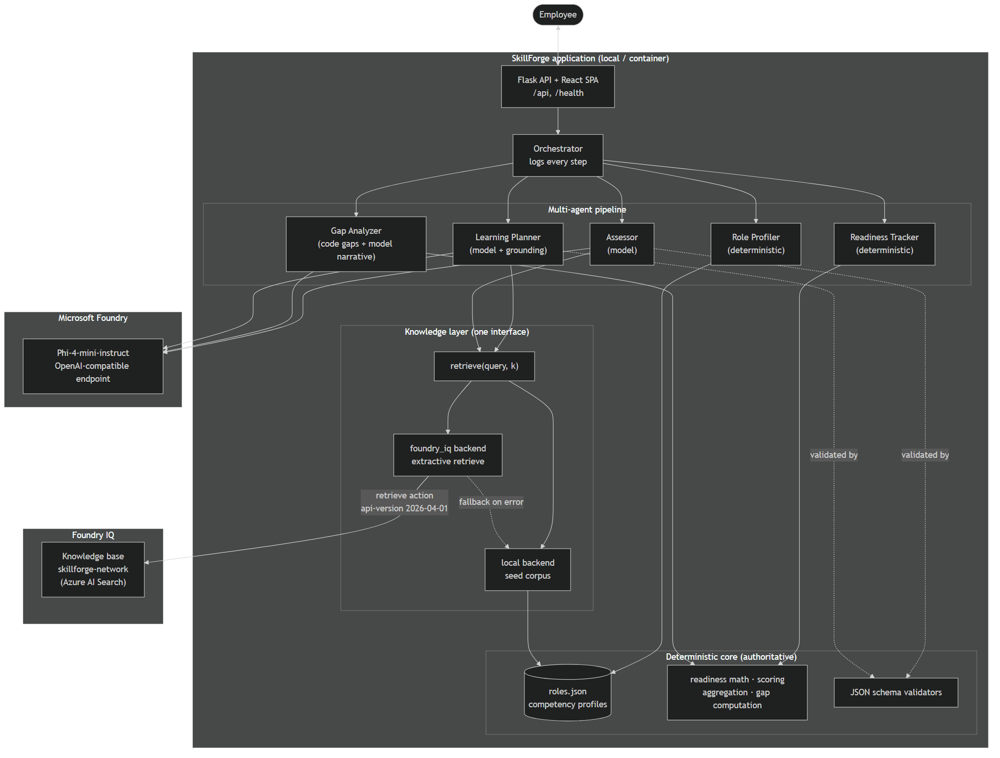

# SkillForge

SkillForge gets a person ready for a role. You pick a target role, take a short
mock assessment, and the system scores you against that role's competency
profile, finds the gaps, and builds a grounded learning plan with citations to
close them. The framing is enterprise onboarding and internal mobility; the demo
domain is network, cloud, and security roles.

It is a multi-agent system on Microsoft Foundry. The language model is
`Phi-4-mini-instruct`, reached through the Foundry OpenAI-compatible endpoint.
Grounded knowledge comes from either a local seed corpus (offline) or a Foundry
IQ knowledge base, selected by an environment variable. The scoring and readiness
math are deterministic and computed in code, never by the model.



## How it works

Five agents run in a pipeline that the orchestrator drives and logs step by step:

| Agent | Role | Driven by |
| --- | --- | --- |
| Role Profiler | Loads the target role's competency profile (the semantic business model) | Deterministic |
| Assessor | Writes one question per top competency, then grades each free-text answer | Model (Phi-4) |
| Gap Analyzer | Gaps are computed in code; the model writes the narrative | Hybrid |
| Learning Planner | Retrieves grounded passages and builds a cited plan per gap | Model + grounding |
| Readiness Tracker | Computes the weighted readiness percent, strengths, gaps, next steps | Deterministic |

The model only ever produces language: questions, evaluations, narratives, and
plan text. Every call runs in JSON mode at temperature 0 against a tight schema
with a one-shot example, and the output is validated. If a call fails or the
model is not configured, the agent falls back to deterministic text so the whole
pipeline still completes offline.

The role profiles, level scale, score aggregation, gap computation, and the
readiness math live in `skillforge/domain.py` and are driven entirely by
`data/roles.json`.

### Roles

Eight roles share a single weighted competency taxonomy (weights sum to 1.0 per
role, each competency carries a target level on the none / aware / working /
proficient scale, and ids are shared across related roles):

Network Engineer, Network Architect, Network Automation Engineer, Cloud Network
Engineer, NOC Engineer, Wireless Network Engineer, Network Security Engineer,
and SOC Analyst. Every competency maps to one or more of the fourteen seed docs
in `data/seed_corpus/`, so the planner can always ground and cite.

### Knowledge backends

One retrieval interface, two backends, chosen by `KNOWLEDGE_BACKEND`:

- `local` (default): paragraph-level retrieval over `data/seed_corpus/`. Fully
  offline.
- `foundry_iq`: queries the Foundry IQ knowledge base `skillforge-network` with
  the Azure AI Search **retrieve** action in extractive mode (no LLM, no answer
  synthesis), api-version `2026-04-01`. It returns cited passages. On any error
  it logs one warning to stderr and falls back to the local corpus.

## Quick start (fresh clone)

Requires Python 3.11 to 3.13 and Node 20+.

```bash
# 1. Python environment
python -m venv .venv
.\.venv\Scripts\Activate.ps1            # Windows PowerShell
# source .venv/bin/activate             # macOS / Linux
.\.venv\Scripts\python.exe -m pip install -r requirements.txt

# 2. Configuration
cp .env.example .env                    # then fill in the Foundry values
# Leave KNOWLEDGE_BACKEND=local to run fully offline.

# 3. Build the frontend (outputs into web/static)
cd frontend
npm install
npm run build
cd ..

# 4. Run
.\.venv\Scripts\python.exe -m web.app   # serves on http://localhost:8000
```

Open `http://localhost:8000`, pick a role, answer the questions, and read the
readiness gauge, the strengths and gaps, and the grounded learning plan.

Without any Foundry credentials the app still runs: assessment questions,
evaluations, and narratives use the deterministic fallback, and knowledge is
served from the local corpus.

### Frontend development

```bash
cd frontend
npm run dev        # Vite dev server, proxies /api and /health to :8000
```

Run the Flask app in another terminal so the API is available.

## Tests

```bash
.\.venv\Scripts\python.exe -m pytest                 # full offline suite
.\.venv\Scripts\python.exe -m pytest --run-slow      # also hit the live Foundry endpoint
```

Non-slow tests scrub the `FOUNDRY_*` variables, so they never touch the network.
Live tests are marked `slow` and skipped by default.

Lint and type check:

```bash
uvx ruff check .
uvx ty check skillforge web tests
cd frontend && npm run lint
```

## Deployment

The app is env-driven and exposes a `/health` endpoint, so it runs unchanged
from local to production.

**Container.** The included `Dockerfile` builds the SPA and serves the API with
gunicorn as a non-root user:

```bash
docker build -t skillforge .
docker run -p 8000:8000 --env-file .env skillforge
```

**Azure Container Apps.** Push the image to a registry and deploy it as a
container app. Provide the `FOUNDRY_*` values as secrets, set `PORT=8000`, and
point the ingress health probe at `/health`. For the `foundry_iq` backend, give
the container a managed identity with the **Search Index Data Reader** role on
the search service and leave `FOUNDRY_IQ_SEARCH_KEY` blank to use Entra ID.

**Microsoft Foundry Hosted Agents.** The orchestrator and agents are plain
Python with no server assumptions, so the same pipeline can be packaged and run
as a hosted agent, with the knowledge layer pointed at Foundry IQ.

## Layout

```
skillforge/        orchestrator, agents/, knowledge/, deterministic core
web/               Flask app and the built SPA (web/static)
frontend/          React 19 + TypeScript + Vite + Tailwind source
data/              roles.json and the 14-doc seed_corpus
tests/             unit and integration tests
docs/              architecture diagram
```

## Configuration reference

| Variable | Purpose |
| --- | --- |
| `FOUNDRY_ENDPOINT` | Phi-4 OpenAI-compatible endpoint |
| `FOUNDRY_MODEL_DEPLOYMENT` | Model deployment name (`Phi-4-mini-instruct`) |
| `FOUNDRY_API_KEY` | Model key |
| `FOUNDRY_IQ_SEARCH_ENDPOINT` | Azure AI Search service backing the knowledge base |
| `FOUNDRY_IQ_KNOWLEDGE_BASE` | Knowledge base name (`skillforge-network`) |
| `FOUNDRY_IQ_SEARCH_KEY` | Search key, or blank to use Entra ID |
| `FOUNDRY_IQ_API_VERSION` | Retrieve api-version (`2026-04-01`) |
| `KNOWLEDGE_BACKEND` | `local` or `foundry_iq` |

Copy `.env.example` to `.env` and fill in the values. `.env` is gitignored and
must never be committed.
